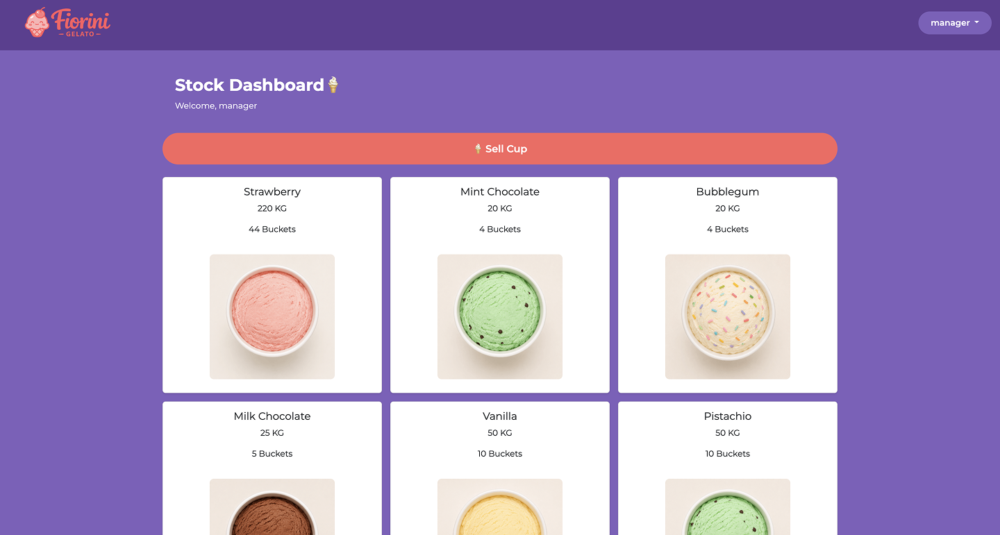

# 🍦 Ice Cream Stock - Fiorini Gelato

This project was inspired by my personal experience working in a gelato shop. The shop had a system to track sales, but there was no proper way to monitor stock levels in real time. I built this tool to try to fill that gap. It is a simple, visual inventory system that helps manage daily operations and stock by keeping track of flavors, quantities in kilograms, and the number of buckets available. It includes role-based access for login (Staff and Manager), a visual card dashboard,  and a detailed stock management table.

Built with Java Spring Boot on the back end and vanilla HTML/CSS/JavaScript on the front end.

**Screenshots:**



**What it does:**
- View all flavors as visual cards (with color-coded icons)
- Sell cups and automatically update stock
- Add, edit, and delete flavors (CRUD)
- Role-based views (staff or manager)
- Paginated card view
- Responsive layout

**What I learned:**

- Building a REST API with Spring Boot
- Using JPA/Hibernate for database persistence
- Connecting a frontend to a backend using Fetch API
- Implementing role-based access control
- Managing state with localStorage

---

## Built With

**Backend**  
- Java 17  
- Spring Boot 3.2.0  
- Spring Data JPA (Hibernate)  
- REST API (Spring Web)
- PostgreSQL (via Docker)  
- Maven  

**Frontend**  
- HTML5  
- CSS3 (Bootstrap 5)  
- Vanilla JavaScript (Fetch API)  

**Tools**  
- Docker (PostgreSQL container)  
- IntelliJ IDEA  
- VS Code  
- Postman (API testing)  
- Git / GitHub  

---

## Default Users

| Role | Username | Password |
|------|----------|----------|
| Manager | `manager` | `1234` |
| Staff | `staff` | `1234` |

---

## Getting Started

### 1. Clone the repository
```bash
git clone https://github.com/your-username/ice-cream-stock.git
cd ice-cream-stock
